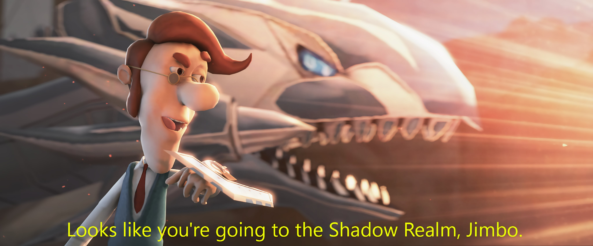

# Introduction

## What Is This?

This is avery rudimentary guide on how to archive and store streams, compiled by a fan of [Hoshimachi Suisei](https://www.youtube.com/channel/UC5CwaMl1eIgY8h02uZw7u8A).

## Why?

As much as we want to, it's not always the case that we can watch our favourite streams from start to finish. Some of us live in timezones that make it impossible to watch streams live. Some streamers mitigate this by leaving their streams archive up. 

Sadly, we cannot rely that stream archives will always be up. Here are a few examples
 * It is an unarchived karaoke stream  
 Often streamers sing songs that they do not have permissions for. It does not mean they are *illegal*, it just means that them (or their company) is trying to cover their bases and not get sued/copystriked in the future
 * Graduations/Wipes 
 In the regrettable, but sadly common occurence nowadays, streamers (especially VTubers), may graduate (stopping their activity). This may include their channels (and their entire back catalog) being sent to the shadow realm (e.g. Rushia Uruha. No Hyperlink because... yea...)  <figure>  <figcaption align="center">*That was one step too far, Jimbo.*</figcaption></figure>  While some graduate amicably ([Kiryu Coco](https://www.youtube.com/channel/UCS9uQI-jC3DE0L4IpXyvr6w) and [Tsukumo Sana](https://www.youtube.com/channel/UCsUj0dszADCGbF3gNrQEuSQ) from Hololive, and soon, [Makoto and Akira Misaki](https://www.youtube.com/channel/UC6m64Oc1vvb_hpyOLRtxaYg) from GGN Live With You, among others), and managed to keep most of their back catalog up, some content (such as members-only content) are still gone forever.

## Acknowledgements
This guide builds on previous work done by [Aozaki](https://aozaki.cc/), who owned and maintaied [guide.suisei.cc](https://guide.suisei.cc) (I find it hillarious that said domain points to [https://www.nijisanji.jp/](https://www.nijisanji.jp/) now. Nothing like corpo rivalry, eh, kids?) and the wider ["Project Stargazer"](https://ko-fi.com/post/Details-of-the-work-I-am-currently-working-on-T6T66CQ71). They had [stepped down](https://ko-fi.com/aozaki) from said project late November 2022 due to personal reasons. 

Although said website was archived at [the Internet Archives](https://web.archive.org/web/20221004095611/https://guide.suisei.cc/), it doesn't work that well anymore, so I decided to make what is mostly a clone, with small improvements here and there. This website is based on [Docusaurus](https://docusaurus.io/), a static site generator, which ensures that this website can be archived properly if one day I forget to renew the domain registration.

Three names come to mind that I'd like to acknowledge personally. Mr [Rahmat Mustafa Samik-Ibrahim](https://cbkadal.blogspot.com/) (also known as Cicak Bin Kadal), my [Operating Systems](https://os.vlsm.org) professor, who encouraged creating guides to help others, LilBoyDestiny, who dragged me into this damn rabbithole in the first place, and of course, last but definitely not least, [Hoshimachi Suisei](https://www.youtube.com/channel/UC5CwaMl1eIgY8h02uZw7u8A) herself.

## License
__This work is distributed under the MIT License__

Permission is hereby granted, free of charge, to any person obtaining a copy of this software and associated documentation files (the "Software"), to deal in the Software without restriction, including without limitation the rights to use, copy, modify, merge, publish, distribute, sublicense, and/or sell copies of the Software, and to permit persons to whom the Software is furnished to do so, subject to the following conditions:

The above copyright notice and this permission notice shall be included in all copies or substantial portions of the Software.

THE SOFTWARE IS PROVIDED "AS IS", WITHOUT WARRANTY OF ANY KIND, EXPRESS OR IMPLIED, INCLUDING BUT NOT LIMITED TO THE WARRANTIES OF MERCHANTABILITY, FITNESS FOR A PARTICULAR PURPOSE AND NONINFRINGEMENT. IN NO EVENT SHALL THE AUTHORS OR COPYRIGHT HOLDERS BE LIABLE FOR ANY CLAIM, DAMAGES OR OTHER LIABILITY, WHETHER IN AN ACTION OF CONTRACT, TORT OR OTHERWISE, ARISING FROM, OUT OF OR IN CONNECTION WITH THE SOFTWARE OR THE USE OR OTHER DEALINGS IN THE SOFTWARE.

## Disclaimers
This guide is made to promote the proliferation of Vtubers, and generally streamers, by the archival of streams. No actions made using this software shall harm Talents, Livers, their Company, or streamers in general. Requests from Cover Corporation, Anycolor Inc, or any and all streamers who are negatively affected by the existence fo this website, to take this guide down, will, if reasonable, upon verification be fullfilled. As stated in the license, I do not take responsibility for the use of this guide.

### DO NOT
* Claim archived content as yours. It is not.
* __Do not redistribute archived content without consent__! *ESPECIALLY* if they are members only!

You are free to share, copy and redistribute the material of this site in any medium or format for any purpose, even commercially. Please give appropriate credit, provide a link to the page, and indicate if changes were made. You may do so in any reasonable manner. You should not apply legal terms or technological measures, that legally restrict others from doing anything that is permitted here.

This site is based on "*Google Sana, Google Sini, Coba Itu, Coba Ini, Lalu Tanya-tanyi* (GSGSCICILTT)" [Lit: "Google here, Google There, Try that, try this, then ask".] philosophy by [Rahmat Mustafa Samik-Ibrahim](https://cbkadal.blogspot.com/). You can call this either __PLAGIARISM__ or __RESEARCH__. I never claim that this is original work, nor that this is the optimum solution, and definitely not to be considered for Scopus :). Please leave comments, critique, and feedback, expecially if you have a better alternate solution. Hopefully this document will be useful in the future, when I have forgotten how to solve this trivial problem.

