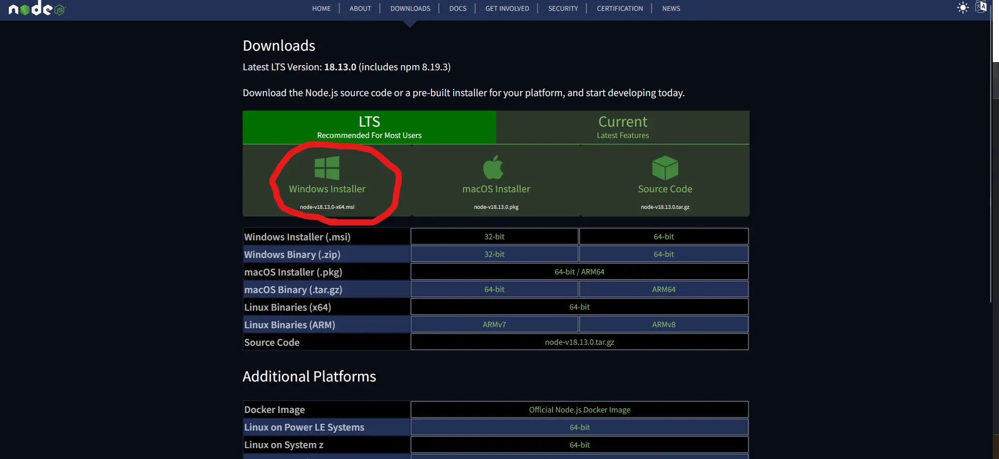
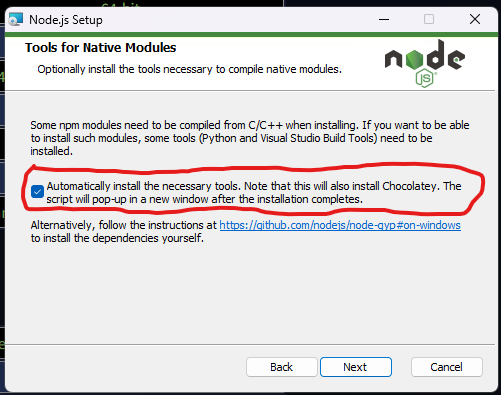

# kkr

A specialized tool to download livestreams.

## Why use this over [`yt-dlp`](/docs/tools/yt-dlp/)?

[`yt-dlp`](/docs/tools/yt-dlp/) is quite a powerful tool. At the time of writing of the previous guide, it's live-download feature is still at it's infancy, and therefore not truly stable. Therefore, I am leaving this guide here as an alternative.

## Prerequisites

This tool requires [`ffmpeg`](/docs/tools/ffmpeg/). Please ensure you have it installed.
This tool is build on [`Node JS`](https://nodejs.org/en/). The following is a short tutorial to install NodeJS.

### Windows
For Windows, please download and use [the installer](https://nodejs.org/en/download/). Choose the LTS Windows installer.

Install using all default settings, but ensure at this step, this checkbox is checked. 

### Linux, MacOS
Although some distributions can reliably install NodeJS with their native package manager, this is not always the case. For example, `apt` (Debian and it's distributions) are known to not carry the most recent NodeJS version. Therefore, to ensure a uniform experience, this guide will use [`tj/n`](https://github.com/tj/n), a NodeJS version manager and installer.

```bash
curl -fsSL https://raw.githubusercontent.com/tj/n/master/bin/n | bash -s lts
npm install -g n
```
This script will directly install the `lts` version of NodeJS to your system. 

### Installation
To install `kkr`, run the follwoing command:
```bash
npm i -g kkr
```
This `i`nstalls `kkr` on your system `g`lobally, so you can run it from any directory on your machine.

### Usage

You can run `kkr` on an upcoming stream or a currently running stream. However, when recording an already running stream, it might not be possible to download the stream from start. Please check the caveats mentioned [here](/docs/tools/yt-dlp/#recording-ongoing-or-scheduled-livestreams).
Same as [`yt-dlp`](/docs/tools/yt-dlp), when given an upcoming stream, `kkr` will automatically retry to download untill the stream actually starts.
```bash
kkr -d "youtube link here" --live --force-merge     
```
`--force-merge` is used to ensure that even if there's a corrupted chunk in the recording, `kkr` will attempt to download and merge the available parts.
