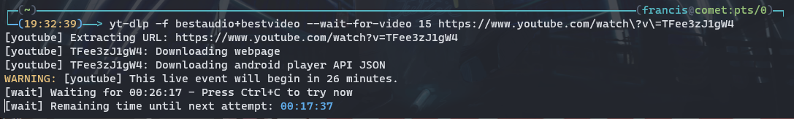

# yt-dlp

Supported: YouTube, SPWN, and [everything on this list!](https://raw.githubusercontent.com/yt-dlp/yt-dlp/master/supportedsites.md)

[`yt-dlp`](https://github.com/yt-dlp/yt-dlp) is a fork of [`youtube-dl`](https://ytdl-org.github.io/youtube-dl/), a "Command-line program to download videos from YouTube.com and other video sites", which I find to be more convenient and more-feature complete in most circumstances.

As with most options on this guide, I would assume that you are comfortable with using Command-Line interfaces. However, it is not nescessary. Just follow along, and you'll be fine!

## What does this tool do?
As of November 2020, YouTube stores its high-quality videos in seperate audio and video streams. As (presumably) you want to save the best possible video and audio, we need to download *both* streams then merge them to a single file. 

To be able to merge said files, we need to defer the process to [ffmpeg](/docs/tools/ffmpeg/).

## Installation
### Windows 
Download the [latest release](https://github.com/yt-dlp/yt-dlp/releases) (Preferrably the `.exe`). You can run it as-is by opening PowerShell on your downloads folder, and typing in
```powershell
./yt-dlp
```
This command should return
```
PS D:\Users\sui\Downloads> ./yt-dlp

Usage: yt-dlp.exe [OPTIONS] URL [URL...]

yt-dlp.exe: error: You must provide at least one URL.
Type yt-dlp --help to see a list of all options.
```
### Linux
Using your favourite package manager (e.g. `apt` for ubuntu, or `aur` for arch), install the following packages:
```
python3
python3-pip
python-is-python3
atomicparsley
```
Installation of `yt-dlp` itself can be achieved in 2 ways, either by directly getting the precompiled binaries directly or using [pip](https://pypi.org/project/pip/ )(Python's Package Manager)

#### Installation using binaries
```bash
sudo curl -L https://github.com/yt-dlp/yt-dlp/releases/latest/download/yt-dlp -o /usr/local/bin/yt-dlp
# Downloads the latest release from GitHub and stores it in /usr/local/bin/yt-dlp
# You can also use, in place of curl, wget and aria2c
sudo chmod a+rx /usr/local/bin/youtube-dl
# Grants read and execute permissions to all users for yt-dlp
```

#### Installation using pip
```bash
sudo -H python3 -m pip install -U yt-dlp 
# Installs yt-dlp globally
```

## Basic Usage

In the simplest of terms, you can download a video just with the following command.
Assuming you want to download [Suisei's Stellar Stellar](https://www.youtube.com/watch?v=a51VH9BYzZA) with the url `https://www.youtube.com/watch?v=a51VH9BYzZA`
``` bash
yt-dlp "https://www.youtube.com/watch?v=a51VH9BYzZA"
```

## Advanced Usage
### Choosing formats
You can select formats you want downloaded. To show all formats, use `-F`
```bash
yt-dlp "https://www.youtube.com/watch?v=a51VH9BYzZA" -F
```
The output should be as follows: 
```bash
yt-dlp "https://www.youtube.com/watch?v=a51VH9BYzZA" -F                                                                          2
[youtube] a51VH9BYzZA: Downloading webpage
[youtube] a51VH9BYzZA: Downloading android player API JSON
[info] a51VH9BYzZA: Downloading subtitles: en, en-zVxKeCQ1ZAM
[info] Available formats for a51VH9BYzZA:
ID  EXT   RESOLUTION FPS CH │   FILESIZE   TBR PROTO │ VCODEC          VBR ACODEC      ABR ASR MORE INFO
──────────────────────────────────────────────────────────────────────────────────────────────────────────────────
sb2 mhtml 48x27        0    │                  mhtml │ images                                  storyboard
sb1 mhtml 80x45        0    │                  mhtml │ images                                  storyboard
sb0 mhtml 160x90       0    │                  mhtml │ images                                  storyboard
599 m4a   audio only      2 │    1.12MiB   31k https │ audio only          mp4a.40.5   31k 22k ultralow, m4a_dash
600 webm  audio only      2 │    1.22MiB   33k https │ audio only          opus        33k 48k ultralow, webm_dash
139 m4a   audio only      2 │    1.77MiB   49k https │ audio only          mp4a.40.5   49k 22k low, m4a_dash
249 webm  audio only      2 │    1.79MiB   49k https │ audio only          opus        49k 48k low, webm_dash
250 webm  audio only      2 │    2.36MiB   65k https │ audio only          opus        65k 48k low, webm_dash
140 m4a   audio only      2 │    4.71MiB  129k https │ audio only          mp4a.40.2  129k 44k medium, m4a_dash
251 webm  audio only      2 │    4.62MiB  127k https │ audio only          opus       127k 48k medium, webm_dash
17  3gp   176x144     12  1 │    2.78MiB   76k https │ mp4v.20.3       76k mp4a.40.2    0k 22k 144p
597 mp4   256x144     12    │    1.10MiB   30k https │ avc1.4d400b     30k video only          144p, mp4_dash
598 webm  256x144     12    │  821.63KiB   22k https │ vp9             22k video only          144p, webm_dash
394 mp4   256x144     24    │    2.26MiB   62k https │ av01.0.00M.08   62k video only          144p, mp4_dash
160 mp4   256x144     24    │    1.79MiB   49k https │ avc1.4d400c     49k video only          144p, mp4_dash
278 webm  256x144     24    │    2.69MiB   74k https │ vp9             74k video only          144p, webm_dash
395 mp4   426x240     24    │    3.19MiB   88k https │ av01.0.00M.08   88k video only          240p, mp4_dash
133 mp4   426x240     24    │    2.99MiB   82k https │ avc1.4d4015     82k video only          240p, mp4_dash
242 webm  426x240     24    │    3.53MiB   97k https │ vp9             97k video only          240p, webm_dash
396 mp4   640x360     24    │    6.00MiB  165k https │ av01.0.01M.08  165k video only          360p, mp4_dash
134 mp4   640x360     24    │    5.23MiB  144k https │ avc1.4d401e    144k video only          360p, mp4_dash
18  mp4   640x360     24  2 │ ~ 10.16MiB  273k https │ avc1.42001E    273k mp4a.40.2    0k 44k 360p
243 webm  640x360     24    │    6.16MiB  170k https │ vp9            170k video only          360p, webm_dash
397 mp4   854x480     24    │   10.12MiB  278k https │ av01.0.04M.08  278k video only          480p, mp4_dash
135 mp4   854x480     24    │    8.00MiB  220k https │ avc1.4d401e    220k video only          480p, mp4_dash
244 webm  854x480     24    │    9.23MiB  254k https │ vp9            254k video only          480p, webm_dash
22  mp4   1280x720    24  2 │ ~ 19.61MiB  527k https │ avc1.64001F    527k mp4a.40.2    0k 44k 720p
398 mp4   1280x720    24    │   19.25MiB  530k https │ av01.0.05M.08  530k video only          720p, mp4_dash
136 mp4   1280x720    24    │   14.46MiB  398k https │ avc1.4d401f    398k video only          720p, mp4_dash
247 webm  1280x720    24    │   15.64MiB  430k https │ vp9            430k video only          720p, webm_dash
399 mp4   1920x1080   24    │   33.00MiB  908k https │ av01.0.08M.08  908k video only          1080p, mp4_dash
137 mp4   1920x1080   24    │   49.22MiB 1354k https │ avc1.640028   1354k video only          1080p, mp4_dash
248 webm  1920x1080   24    │   41.45MiB 1140k https │ vp9           1140k video only          1080p, webm_dash
```
To download a particular format, say the best audio available, we can either:
```bash
yt-dlp "https://www.youtube.com/watch?v=a51VH9BYzZA" -f 251
# OR
yt-dlp "https://www.youtube.com/watch?v=a51VH9BYzZA" -f "bestaudio"
```

To download the best possible audio and video, and automatically merge both streams:
```bash 
yt-dlp "https://www.youtube.com/watch?v=a51VH9BYzZA" -f "bestvideo+bestaudio"
```
### Setting save location
To set filename and save location, we use `-o`

For example, if I wanted to save the video in `/home/sui/raw/StellarStellar.mp4`
```bash
yt-dlp "https://www.youtube.com/watch?v=a51VH9BYzZA" -o '/home/sui/raw/StellarStellar.mp4'
```
And we can also use variables in the filename!
```bash
yt-dlp "https://www.youtube.com/watch?v=a51VH9BYzZA" -o '/home/sui/raw/%(upload_date)s %(title)s.%(ext)s.mp4'
```

### Cookies
To be able to access membership streams (which you have legal access to), you can export your cookies from your favourite browser using extensions, such as [`cookies-txt`](https://github.com/lennonhill/cookies-txt). After getting said `cookies.txt`, say if it's located in `/home/sui/cookies.txt`, 
```bash
yt-dlp "https://www.youtube.com/watch?v=a51VH9BYzZA" --cookies '/home/sui/cookies.txt'
```

### Configuration File
To help quickly downloading videos on command, you might want to save above command line options into a configuration file. <br />
For Windows: `%APPDATA%\yt-dlp\config.txt`<br />
For Linux: `/etc/yt-dlp.conf`<br />

As for the contents, here is what I personally use. Feel free to tweak it to your own use and preferences.

```
-o '/home/sui/raw/%(upload_date)s %(title)s.%(ext)s' # replace the directory
--embed-thumbnail
--format 'bestvideo+bestaudio/best/mp4'
--merge-output-format mp4
--add-metadata
--cookies '/home/sui/cookies.txt'
--concurrent-fragments 2
--write-subs       
--sub-langs "en.*,jp,id"
```
Explaination: <br />
```
Ln 3 ensures that yt-dlp will always download the best available audio/video combo
Ln 4 ensures the output to be .mp4
Ln 5 saves the video's metadata (we are here to archive after all)
Ln 7 allows yt-dlp to download more chunks simultaniously
Ln 8 saves subtitles
Ln 9 configures which subtitles to download
```

### Recording ongoing (or scheduled) livestreams.
It is possible to add `--live-from-start` to download an ongoing livestream from the start.

However, most VTubers (especially ones represented by an agency) tend to not alow DVR (e.g. let you seek to a previous point in the stream, while the stream is happening). This has the effect of making it impossible to download said stream if recording is not done from the beginning.

If you are able to start `yt-dlp` before the stream starts (e.g. you are aware of it being scheduled), you can use `--wait-for-video n`, where `n` is an integer. This option will mak e `yt-dlp` try to start downloading the stream, and if it's not started yet, try again in `n` seconds. For example, `--wait-for-video 60` makes `yt-dlp` keep trying every minute.

<div style={{textAlign: 'center'}}>



</div>

``` bash
yt-dlp -f bestaudio+bestvideo --wait-for-video 15 https://www.youtube.com/watch\?v\=TFee3zJ1gW4
```
`yt-dlp` will automatically lookup when the stream is supposed to start, then will keep retrying to download the stream as it starts

An alternative to doing this is using [`kkr`](/docs/tools/kkr/).

## SPWN and Nissin
SPWN and Nissin are two of the most popular ways Cover use for paid lives (e.g. Sololives and HoloFes). It is possible to download them using `yt-dlp`, however it requires some special setup.


:::warning

Please be informed that I have not personally tested this method. Therefore, I am basing this section purely based on the previous guide's implementation. I will test this during Suisei's 2nd Sololive however :) 

:::

:::info
During [Suisei's 2nd Sololive](https://virtual.spwn.jp/events/23012802-engsuisei2ndlive), I was unable to get this to work. I was able to, however, use [Free Download Manager](https://www.freedownloadmanager.org/) instead.
:::


<div style={{textAlign: 'center'}}>


</div>

After entering the streaming page, press F12 on your keyboard to bring up the developer console for your browser. Click on the "Network" tab on the top (the RED arrow).

In the "Filter URLs" section, type in m3u8, then refresh the page. You should see the main .m3u8 link generated (the GREEN arrow).

If the default resolution isn't 1080p don't worry, keep the developer console open and select 1080p manually and you should be able to see the main .m3u8 link generate.

Right click the .m3u8 link (the BLUE arrow), and select Copy > Copy URL. This is the URL to the actual video source, so make sure you write it down somewhere

### Get Cookies
To let `yt-dlp` download the stream, you have to give them cookies to SPWN/Nissin. Use the method outlined in the cookies section above to retrieve and save said cookies.

### Quality Selection
As SPWN/Nissin's systems are different than YouTube's - there's no guarantee that the option `bestaudio+bestvideo` will work. Therefore, we need to use the `-F` flag to find out the available formats. Use the Format Selection section above to find the best audio and video formats available

### Command
Your command should look something like this
```bash
yt-dlp ".m3u8 link" --cookies "cookies.txt path" -o "save path" -f 5279+program_audio-Fine
```